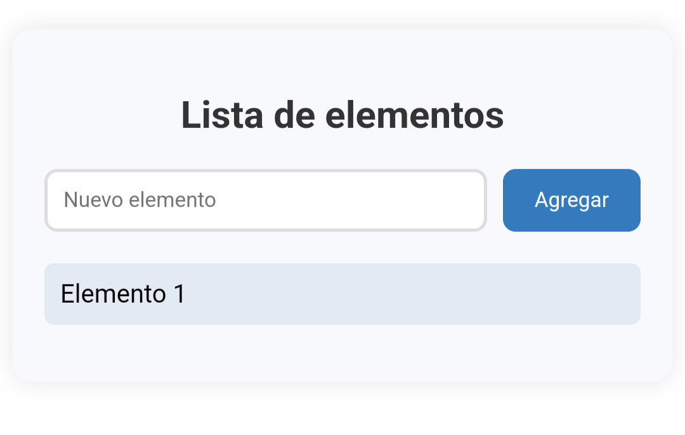

Lista de Elementos - Angular App ✅

¡Hola! Esta es una pequeña aplicación web creada con Angular 17 como parte de un ejercicio de curso. El objetivo: gestionar una lista dinámica de elementos, aplicando conceptos como componentes standalone, formularios reactivos, animaciones y despliegue en GitHub Pages.

---

## ✨ Funcionalidades

- Añadir elementos a una lista
- Animación suave al añadir elementos (`fadeInUp`)
- Componentes standalone (sin `NgModule`)
- Estilos CSS personalizados
- Despliegue automático a GitHub Pages

---

## ⚙️ Tecnologías utilizadas

- Angular 17
- TypeScript
- HTML & CSS
- Angular Animations
- Git + GitHub Pages

---

## 🛠️ Pasos de desarrollo

### 1. Inicialización del proyecto

ng new lista-de-elementos --standalone
cd lista-de-elementos

> Se eligió no usar routing y se seleccionó standalone components.

---

2. Creación del componente

ng generate component lista-elementos --standalone

Este componente permite introducir texto y mostrarlo en una lista usando *ngFor y [(ngModel)].

---

3. Importación de módulos necesarios

En el componente se añadieron los siguientes imports:

imports: [CommonModule, FormsModule]

---

4. Animaciones

Se instalaron y usaron animaciones para transiciones suaves:

npm install @angular/animations

Y se definió la animación fadeInUp para elementos nuevos de la lista.

---

5. Control de versiones

git init
git remote add origin https://github.com/jesanre/lista-de-elementos.git
git add .
git commit -m "Primer commit"

---

6. Preparación para despliegue

Se añadió el paquete de despliegue:

ng add angular-cli-ghpages

Y en angular.json:

"baseHref": "/lista-de-elementos/"

Luego se desplegó con:

ng deploy

---

🌍 Demo en vivo

URL del proyecto:
https://jesanre.github.io/lista-de-elementos/

---

🖼️ Captura de pantalla

Añade aquí una captura para hacer el README más visual:

---

✍️ Autor

Creado por Jesús Andrade como parte del curso de Angular.
